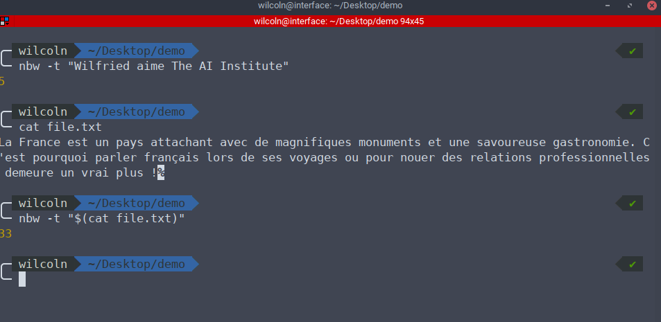

# Server API Python
## Installation
```
sudo apt install python3
sudo apt install python3-pip
cd server
pip3 install -r requirements.txt
```

## Lancement des Test
```
cd server # si besoin
python -m unittest nlp.test
```


## Lancement du serveur
```
cd server # si besoin
python3 api.py
```

**NB**: Le serveur se lancera sur le port `5000`

## Démo
Bien vouloir consulter la capture d'écran `./server/demos/curl.png`


Le serveur se lancera sur le port `5000`

# Client Node.js
## Installation
- Installer nodejs 12.18.3
- Installer npm 6.14.6
- Installation globales des commandes
    ```
   cd nlp-cli
   sudo npm install -g .
    ```
    

## Lancement
Une fois les commandes installées globalement l'outil peut s'utiliser depuis n'importe quel répertoire
```
nbc -t <text> # nombre de charactères
nbw -t <text> # nombre de mots
occ -t <text> # nombre d'occurences des mots
kw -t <text> -n <nb_keywords> # Extraction des mots clés 
```

## Démos
Bien vouloir consulter les captures d'écran qui se trouvent dans le répertoire `./nlp-cli/demos/`
- `nbc`: `nbCharacters`
    
    
- `nbw`: `nbWords`
    
  
- `occ`: `occurrences`
    